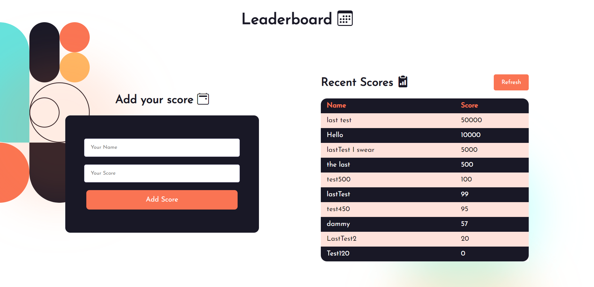

# Project Name

> Leaderboard is a website that has its data preserved with the external Leaderboard API serice. It displays the names and scores of different people and also allows you add your own score to the leaderboard.

## Screenshots 📸

## Built With

- HTML5
- CSS3
- JavaScript
- Webpack
- API 

## Live Demo

A live version of the working website can be seen [here](https://ishpaul777.github.io/Leaderboard/)

## Getting Started
To get a local copy up and running follow these simple example steps.

- You can clone this repo by typing git clone https://github.com/ishpaul777/Leaderboard.git on your terminal.
- Type cd Leaderboard-Project to access the project on the terminal.
- Run npm install from your editor's terminal.
- Run npm run build from your editor's terminal.
- Run npm start from your editor's terminal to view the project in your browser.

## Authors

👤 **Ishpaul Singh**

- Github - [@ishpaul777](https://github.com/ishpaul777)
- Twitter - [@ishpaul777](https://twitter.com/ishpaul777)
- Linkedin - [Ishpaul Singh](https://www.linkedin.com/in/ishpaul-singh-264590226/)

## 🤝 Contributing

Contributions, issues, and feature requests are welcome!

Feel free to check the [issues page](../../issues/).

## Show your support

Give a ⭐️ if you like this project!

## Acknowledgments

- The project idea is originally Microverse Javascript Curriculum.

## 📝 License

This project is [MIT](./MIT.md) licensed.
